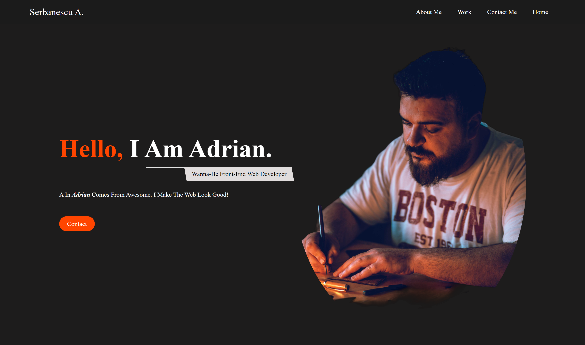

# Description
 
 This is a website i designed to showcase the work I've done and to make it easier for people to contact me.

## Acceptance Criteria

* When the page is loaded the page presents your name, a recent photo or avatar, and links to sections about you, your work, and how to contact you

* When one of the links in the navigation is clicked then the UI scrolls to the corresponding section

* When viewing the section about your work then the section contains titled images of your applications

* When presented with the your first application then that application's image should be larger in size than the others

* When images of the applications are clicked then the user is taken to that deployed application

* When the page is resized or viewed on various screens and devices then the layout is responsive and adapts to my viewport

## Work Completed

* Website shows name, profile picture, and a header with links to some page sections
* Links work to coresponding sections
* Project section contains project cards with coresponding names
* Pirst aplication image is larger than the rest
* When project card is clicked, user is taken to deployed aplication
* Added some design responsivnes for some screen sizes

### Website Link
[Portofolio](https://fishmon.github.io/portofolio-SA/)

### Screenshot

* Watched some tutorials on youtube when i got stuck, [Modern Web](https://www.youtube.com/@ModernWeb) and others.

## Contact
[Serbanescu-Claudiu Adrian](https://github.com/fishmon)
